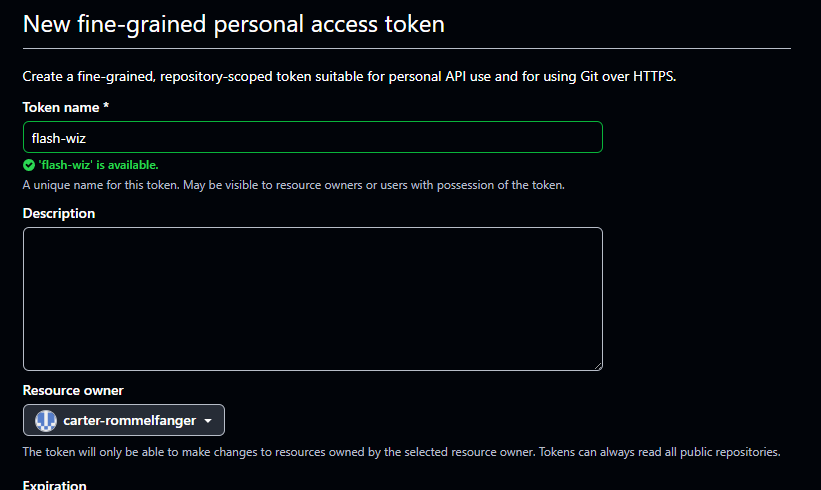
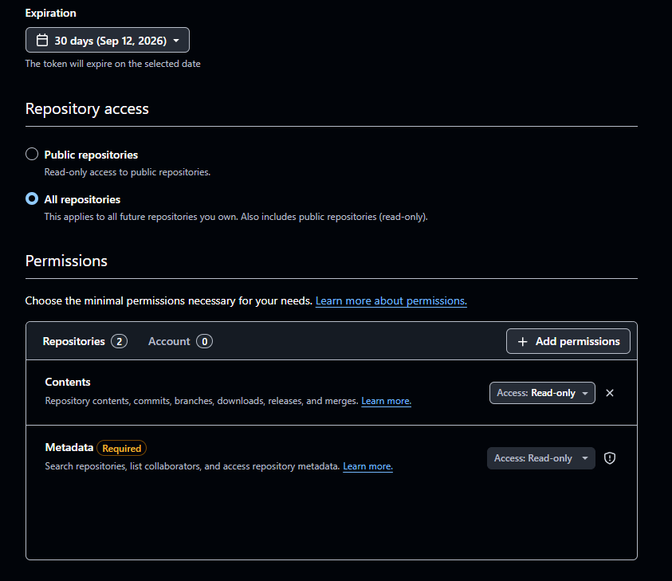
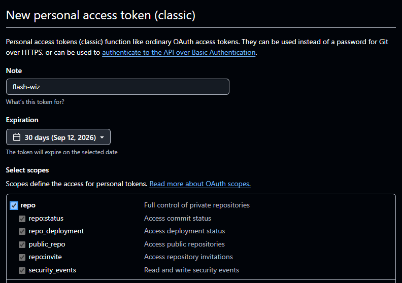

# How to set up a Personal Access Token (PAT)

To load boards or flashing tools from a private GitHub repo (via **Edit > Remote Configurations**, see the main [README](../README.md#fetching-from-private-github-repos)), dev-board-flasher needs a GitHub personal access token with read access to that repo. This walks through creating one and adding it to the app.

## 1. Create the token on GitHub

Go to [github.com/settings/personal-access-tokens](https://github.com/settings/personal-access-tokens/new) to create a **fine-grained** token (recommended, since it can be scoped to just the repos you need):

1. Give it a **Token name** you'll recognize later (e.g. `flash-wiz`) and pick an **Expiration**.

   

2. Under **Repository access**, choose either **Public repositories** (if you only need public repos, no token is actually required for those) or **All repositories** to also cover future private repos — or scope it to specific repos with **Only select repositories**.
3. Under **Permissions**, grant **Contents: Read-only** (needed to fetch the config file). **Metadata: Read-only** is required by GitHub and already included by default.

   

4. Click **Generate token** and copy the value shown — GitHub only displays it once.

If your org has SSO enabled, you'll also need to **Authorize** the token for that organization from the token's settings page before it can read its repos.

### Alternative: classic token

A classic token works too, and is simpler if fine-grained tokens aren't available for your account/org. From [github.com/settings/tokens](https://github.com/settings/tokens/new), give it a note and expiration, and check the **repo** scope (full control of private repositories):

Classic tokens can read every repo you have access to, so prefer a fine-grained token scoped to just what you need where possible.

## 2. Add the token to the app

In dev-board-flasher, open **Edit > Github Personal Access Token**, paste the token into the field, and click OK. The token is stored in your OS's credential store (via [`keyring`](https://pypi.org/project/keyring/) — e.g. Windows Credential Manager) rather than app settings, since it's a secret. You can reopen this dialog at any time to view or replace it.

With the token set, add the repo's board/flashing-tool file to **Edit > Remote Configurations** as either a normal `github.com/{owner}/{repo}/blob/{ref}/{path}` link (copied from browsing the file on GitHub) or a `raw.githubusercontent.com` link, then restart the app (**Edit > Reload App**) to pick it up.
